# radigen3 Modules Documentation

Generated on: **2025-05-23 10:46:13**

There is no preambule.

## Main Classes

<a href="#radigen3_oxidation" style="text-decoration: none; font-weight: bold;">
1. radigen3.oxidation
</a>

<a href="#table_of_contents" title="Back to Table of Contents" style="text-decoration: none;">⬆️ TOC</a>

## Module `radigen3.oxidation`

### Class Inheritance Diagram

```mermaid
graph TD;
H2O
PrintableFigure
TKO2cycle
diAllylicC
diAllylicCH
diAllylicCHO
diAllylicCO
diAllylicCOH
diAllylicCOO
diAllylicCOOH
diAllylicCeqO
lumped
mixture
mixtureKinetics
monoAllylicC
monoAllylicCH
monoAllylicCHO
monoAllylicCO
monoAllylicCOH
monoAllylicCOO
monoAllylicCOOH
monoAllylicCeqO
oxygen
peroxyl
reaction
reactionRateDB
species
terminationPolymers
triAllylicC
triAllylicCH
triAllylicCHO
triAllylicCO
triAllylicCOH
triAllylicCOO
triAllylicCOOH
triAllylicCeqO
Figure --> PrintableFigure
object --> TKO2cycle
object --> mixture
object --> mixtureKinetics
object --> reaction
object --> reactionRateDB
object --> species
species --> H2O
species --> diAllylicC
species --> diAllylicCH
species --> diAllylicCHO
species --> diAllylicCO
species --> diAllylicCOH
species --> diAllylicCOO
species --> diAllylicCOOH
species --> diAllylicCeqO
species --> lumped
species --> monoAllylicC
species --> monoAllylicCH
species --> monoAllylicCHO
species --> monoAllylicCO
species --> monoAllylicCOH
species --> monoAllylicCOO
species --> monoAllylicCOOH
species --> monoAllylicCeqO
species --> oxygen
species --> peroxyl
species --> terminationPolymers
species --> triAllylicC
species --> triAllylicCH
species --> triAllylicCHO
species --> triAllylicCO
species --> triAllylicCOH
species --> triAllylicCOO
species --> triAllylicCOOH
species --> triAllylicCeqO
```

**[Class Examples for `radigen3/oxidation.py` (8)](class_examples.html#radigen3_oxidation)**

### Methods Table

| Class | Method | Docstring First Paragraph | # Lines | __version__ |
|-------|---------|---------------------------|---------|-------------|
| (module-level) | `_generate_figname` | Generate a clean filename based on metadata or current date/time. | 23 | 0.512 |
| (module-level) | `custom_plt_figure` | Ensure all figures use PrintableFigure. | 4 | 0.512 |
| (module-level) | `custom_plt_subplots` | Ensure plt.subplots() returns a PrintableFigure. | 5 | 0.512 |
| (module-level) | `is_valid_figure` | Checks if `fig` is a valid and open Matplotlib figure. | 11 | 0.512 |
| (module-level) | `print_figure` | Save the figure in both PDF and PNG formats. | 16 | 0.512 |
| (module-level) | `print_pdf` | Save a given figure as a PDF. | 29 | 0.512 |
| (module-level) | `print_png` | Save a given figure as a PNG. | 29 | 0.512 |
| `H2O` | `__add__` |  | 2 | 0.512 |
| `H2O` | `__init__` | Initialize a species object with structural, chemical, and contextual attributes. | 2 | 0.512 |
| `H2O` | `__iter__` |  | 8 | 0.512 |
| `H2O` | `__or__` | Return self|value. | 2 | 0.512 |
| `H2O` | `__repr__` | Return repr(self). | 13 | 0.512 |
| `H2O` | `__str__` | Return str(self). | 2 | 0.512 |
| `H2O` | `create` | Factory method to create a species by name or alias. | 20 | 0.512 |
| `PrintableFigure` | `print` |  | 2 | 0.512 |
| `PrintableFigure` | `print_pdf` |  | 2 | 0.512 |
| `PrintableFigure` | `print_png` |  | 2 | 0.512 |
| `PrintableFigure` | `show` | Show figure based on the environment: - In Jupyter: Uses display(fig) - In scripts or GUI mode: Uses plt.show() | 14 | 0.512 |
| `TKO2cycle` | `__add__` | add a step to an existing cycle | 9 | 0.512 |
| `TKO2cycle` | `__call__` | return interpolated T and kO2 values at t | 5 | 0.512 |
| `TKO2cycle` | `__init__` | TKO2cycle constructor (do not use it directly, call constant/ramp instead) | 10 | 0.512 |
| `TKO2cycle` | `__repr__` | Return repr(self). | 7 | 0.512 |
| `TKO2cycle` | `__str__` | Return str(self). | 2 | 0.512 |
| `diAllylicC` | `__add__` |  | 2 | 0.512 |
| `diAllylicC` | `__init__` | Initialize a species object with structural, chemical, and contextual attributes. | 2 | 0.512 |
| `diAllylicC` | `__iter__` |  | 8 | 0.512 |
| `diAllylicC` | `__or__` | Return self|value. | 2 | 0.512 |
| `diAllylicC` | `__repr__` | Return repr(self). | 13 | 0.512 |
| `diAllylicC` | `__str__` | Return str(self). | 2 | 0.512 |
| `diAllylicC` | `create` | Factory method to create a species by name or alias. | 20 | 0.512 |
| `diAllylicCH` | `__add__` |  | 2 | 0.512 |
| `diAllylicCH` | `__init__` | Initialize a species object with structural, chemical, and contextual attributes. | 2 | 0.512 |
| `diAllylicCH` | `__iter__` |  | 8 | 0.512 |
| `diAllylicCH` | `__or__` | Return self|value. | 2 | 0.512 |
| `diAllylicCH` | `__repr__` | Return repr(self). | 13 | 0.512 |
| `diAllylicCH` | `__str__` | Return str(self). | 2 | 0.512 |
| `diAllylicCH` | `create` | Factory method to create a species by name or alias. | 20 | 0.512 |
| `diAllylicCHO` | `__add__` |  | 2 | 0.512 |
| `diAllylicCHO` | `__init__` | Initialize a species object with structural, chemical, and contextual attributes. | 2 | 0.512 |
| `diAllylicCHO` | `__iter__` |  | 8 | 0.512 |
| `diAllylicCHO` | `__or__` | Return self|value. | 2 | 0.512 |
| `diAllylicCHO` | `__repr__` | Return repr(self). | 13 | 0.512 |
| `diAllylicCHO` | `__str__` | Return str(self). | 2 | 0.512 |
| `diAllylicCHO` | `create` | Factory method to create a species by name or alias. | 20 | 0.512 |
| `diAllylicCO` | `__add__` |  | 2 | 0.512 |
| `diAllylicCO` | `__init__` | Initialize a species object with structural, chemical, and contextual attributes. | 2 | 0.512 |
| `diAllylicCO` | `__iter__` |  | 8 | 0.512 |
| `diAllylicCO` | `__or__` | Return self|value. | 2 | 0.512 |
| `diAllylicCO` | `__repr__` | Return repr(self). | 13 | 0.512 |
| `diAllylicCO` | `__str__` | Return str(self). | 2 | 0.512 |
| `diAllylicCO` | `create` | Factory method to create a species by name or alias. | 20 | 0.512 |
| `diAllylicCOH` | `__add__` |  | 2 | 0.512 |
| `diAllylicCOH` | `__init__` | Initialize a species object with structural, chemical, and contextual attributes. | 59 | 0.512 |
| `diAllylicCOH` | `__iter__` |  | 8 | 0.512 |
| `diAllylicCOH` | `__or__` | Return self|value. | 2 | 0.512 |
| `diAllylicCOH` | `__repr__` | Return repr(self). | 13 | 0.512 |
| `diAllylicCOH` | `__str__` | Return str(self). | 2 | 0.512 |
| `diAllylicCOH` | `create` | Factory method to create a species by name or alias. | 20 | 0.512 |
| `diAllylicCOO` | `__add__` |  | 2 | 0.512 |
| `diAllylicCOO` | `__init__` | Initialize a species object with structural, chemical, and contextual attributes. | 2 | 0.512 |
| `diAllylicCOO` | `__iter__` |  | 8 | 0.512 |
| `diAllylicCOO` | `__or__` | Return self|value. | 2 | 0.512 |
| `diAllylicCOO` | `__repr__` | Return repr(self). | 13 | 0.512 |
| `diAllylicCOO` | `__str__` | Return str(self). | 2 | 0.512 |
| `diAllylicCOO` | `create` | Factory method to create a species by name or alias. | 20 | 0.512 |
| `diAllylicCOOH` | `__add__` |  | 2 | 0.512 |
| `diAllylicCOOH` | `__init__` | Initialize a species object with structural, chemical, and contextual attributes. | 2 | 0.512 |
| `diAllylicCOOH` | `__iter__` |  | 8 | 0.512 |
| `diAllylicCOOH` | `__or__` | Return self|value. | 2 | 0.512 |
| `diAllylicCOOH` | `__repr__` | Return repr(self). | 13 | 0.512 |
| `diAllylicCOOH` | `__str__` | Return str(self). | 2 | 0.512 |
| `diAllylicCOOH` | `create` | Factory method to create a species by name or alias. | 20 | 0.512 |
| `diAllylicCeqO` | `__add__` |  | 2 | 0.512 |
| `diAllylicCeqO` | `__init__` | Initialize a species object with structural, chemical, and contextual attributes. | 2 | 0.512 |
| `diAllylicCeqO` | `__iter__` |  | 8 | 0.512 |
| `diAllylicCeqO` | `__or__` | Return self|value. | 2 | 0.512 |
| `diAllylicCeqO` | `__repr__` | Return repr(self). | 13 | 0.512 |
| `diAllylicCeqO` | `__str__` | Return str(self). | 2 | 0.512 |
| `diAllylicCeqO` | `create` | Factory method to create a species by name or alias. | 20 | 0.512 |
| `lumped` | `__add__` |  | 2 | 0.512 |
| `lumped` | `__init__` | Initialize a species object with structural, chemical, and contextual attributes. | 12 | 0.512 |
| `lumped` | `__iter__` |  | 8 | 0.512 |
| `lumped` | `__or__` | Return self|value. | 2 | 0.512 |
| `lumped` | `__repr__` | Return repr(self). | 13 | 0.512 |
| `lumped` | `__str__` | Return str(self). | 2 | 0.512 |
| `lumped` | `create` | Factory method to create a species by name or alias. | 20 | 0.512 |
| `mixture` | `__add__` | Combine two mixture instances via physical mixing. | 48 | 0.512 |
| `mixture` | `__getitem__` |  | 10 | 0.512 |
| `mixture` | `__init__` | Attributes: name (str): The name of the mixture. description (str): Descriptive text. substances (list): List of species instances, each with an assigned index. | 48 | 0.512 |
| `mixture` | `__iter__` |  | 2 | 0.512 |
| `mixture` | `__len__` |  | 2 | 0.512 |
| `mixture` | `__repr__` | Return repr(self). | 10 | 0.512 |
| `mixture` | `__setattr__` | Implement setattr(self, name, value). | 13 | 0.512 |
| `mixture` | `__setitem__` |  | 5 | 0.512 |
| `mixture` | `__str__` | Return str(self). | 2 | 0.512 |
| `mixture` | `_delete` | delete a species in the mixture | 24 | 0.512 |
| `mixture` | `_make_submixture` | Make a submixture from a mixture | 6 | 0.512 |
| `mixture` | `_replace` | Replace a species in the mixture | 26 | 0.512 |
| `mixture` | `add` | Add a new species to the mixture using a class name or alias. | 30 | 0.512 |
| `mixture` | `addProducts` | Recursively adds all potential product species (with zero concentration) derived from reactions under current reactive conditions. | 51 | 0.512 |
| `mixture` | `addReaction` |  | 12 | 0.512 |
| `mixture` | `addReactions` | Generates all valid reactions based on current species. | 90 | 0.512 |
| `mixture` | `buildStoichiometryMatrix` | Constructs the stoichiometric matrix S of the mixture's reaction network. | 42 | 0.512 |
| `mixture` | `copy` | Returns a deep copy (clone) of the current mixture instance. | 12 | 0.512 |
| `mixture` | `getReactionByFingerprint` | Retrieves the reaction object matching a given fingerprint string. | 14 | 0.512 |
| `mixture` | `getSpeciesByReactiveFunction` | Retrieves a list of species matching a given reactiveFunction. | 11 | 0.512 |
| `mixture` | `get_lumped_by_function` | Returns a lumped object for all species with a given reactive function. | 4 | 0.512 |
| `mixture` | `get_lumped_by_pattern` | Returns a lumped object for species whose attribute (default 'name') matches a regex. | 5 | 0.512 |
| `mixture` | `lumped_alcohols` | Returns a lumped species containing all aldehydes (COH). | 3 | 0.512 |
| `mixture` | `lumped_aldehydes` | Returns a lumped species containing all aldehydes (CHO). | 3 | 0.512 |
| `mixture` | `lumped_hydroperoxides` | Returns a lumped species containing all hydroperoxides (COOH). | 3 | 0.512 |
| `mixture` | `lumped_ketones` | Returns a lumped species containing all aldehydes (CHO). | 3 | 0.512 |
| `mixture` | `lumped_polar_compounds` | Returns a lumped species including compounds with at least one oxygen (based on reactiveFunction/suffix). | 7 | 0.512 |
| `mixture` | `lumped_polymers` | Returns a lumped species containing all polymer termination products. | 3 | 0.512 |
| `mixture` | `lumped_radicals_on_C` | Returns a lumped species with radicals centered on carbon atoms. | 4 | 0.512 |
| `mixture` | `lumped_radicals_on_O` | Returns a lumped species with radicals centered on oxygen atoms. | 4 | 0.512 |
| `mixture` | `populateReactionRates` | Updates reaction rate constants (k0, Ea, T0) from the reactionRateDB based on reaction fingerprints. | 68 | 0.512 |
| `mixture` | `refresh_indices` | Refresh indices of compounds in the mixture. Ensures self._indexmap is contiguous and updates .index attributes. | 14 | 0.512 |
| `mixture` | `stoichiometryDataFrame` | Converts the stoichiometry matrix into a human-readable DataFrame. | 19 | 0.512 |
| `mixtureKinetics` | `KcagefreeROOH` | Returns the equilibrium constant between cage and free hydroperoxides at T | 9 | 0.512 |
| `mixtureKinetics` | `__add__` | Concatenate two mixtureKinetics simulations if compatible. | 65 | 0.512 |
| `mixtureKinetics` | `__init__` | mixtureKinetics constructor | 34 | 0.512 |
| `mixtureKinetics` | `__repr__` | repr() method | 22 | 0.512 |
| `mixtureKinetics` | `__str__` | str() method | 9 | 0.512 |
| `mixtureKinetics` | `cageROOH` | Returns the free conentration of hydroperoxides of type COOH at T | 4 | 0.512 |
| `mixtureKinetics` | `copy` | Returns a deep copy (clone) of the current mixture instance. | 12 | 0.512 |
| `mixtureKinetics` | `freeROOH` | Returns the free conentration of hydroperoxides of type COOH at T | 4 | 0.512 |
| `mixtureKinetics` | `get_C0` | Returns the initial concentration vector C0 from species in the mixture. | 3 | 0.512 |
| `mixtureKinetics` | `get_R` | Computes the vector of reaction rates R at temperature T and concentrations C. | 28 | 0.512 |
| `mixtureKinetics` | `get_dCdt` | Computes the time derivative of species concentrations: | 15 | 0.512 |
| `mixtureKinetics` | `get_dCdt_dynamic` | Computes the time derivative of species concentrations under dynamic T(t) and  kO2(t) conditions | 18 | 0.512 |
| `mixtureKinetics` | `get_interpolator` | Returns an interpolator object to estimate concentrations at arbitrary times. | 10 | 0.512 |
| `mixtureKinetics` | `get_lumped_concentration` | Return the concentration (cumulated) of a registered lumped species. | 8 | 0.512 |
| `mixtureKinetics` | `molarVolume` | Estimate molar volume (m³/mol) of the mixture Args: T (float): Temperature in °C. | 10 | 0.512 |
| `mixtureKinetics` | `oxygen_solubility` | Returns oxygen solubility in mol/(m³·Pa) using Arai et al. (1989) constants. Valid for FAMEs over a wide T range. | 16 | 0.512 |
| `mixtureKinetics` | `parse_time_unit` | Convert a time span with units to seconds, return also the canonical unit and inverse scale. | 48 | 0.512 |
| `mixtureKinetics` | `plot` | Plot the concentration profiles of selected species over time. | 152 | 0.512 |
| `mixtureKinetics` | `register_lumped` | Register a lumped group under a name for plotting/dataframe output. | 8 | 0.512 |
| `mixtureKinetics` | `results_as_dataframe` | Return the time evolution of species as a pandas DataFrame. | 36 | 0.512 |
| `mixtureKinetics` | `rho` | Temperature-dependent density model for mixture. Args: T (float): Temperature in °C. Returns: float: density in kg/m³ | 10 | 0.512 |
| `mixtureKinetics` | `set_C` | Updates the concentrations of species in the mixture. | 12 | 0.512 |
| `mixtureKinetics` | `solve` | Integrate the system of ODEs dC/dt = S·R(C,T) with optional oxygen source and dynamic conditions. | 115 | 0.512 |
| `mixtureKinetics` | `sourceO2` | Oxygen transport model | 7 | 0.512 |
| `mixtureKinetics` | `temporary_kO2` | Temporarily override current kO2 value | 9 |  |
| `mixtureKinetics` | `totalROOH` | Returns the total concentration in hydroperoxides | 3 | 0.512 |
| `monoAllylicC` | `__add__` |  | 2 | 0.512 |
| `monoAllylicC` | `__init__` | Initialize a species object with structural, chemical, and contextual attributes. | 2 | 0.512 |
| `monoAllylicC` | `__iter__` |  | 8 | 0.512 |
| `monoAllylicC` | `__or__` | Return self|value. | 2 | 0.512 |
| `monoAllylicC` | `__repr__` | Return repr(self). | 13 | 0.512 |
| `monoAllylicC` | `__str__` | Return str(self). | 2 | 0.512 |
| `monoAllylicC` | `create` | Factory method to create a species by name or alias. | 20 | 0.512 |
| `monoAllylicCH` | `__add__` |  | 2 | 0.512 |
| `monoAllylicCH` | `__init__` | Initialize a species object with structural, chemical, and contextual attributes. | 2 | 0.512 |
| `monoAllylicCH` | `__iter__` |  | 8 | 0.512 |
| `monoAllylicCH` | `__or__` | Return self|value. | 2 | 0.512 |
| `monoAllylicCH` | `__repr__` | Return repr(self). | 13 | 0.512 |
| `monoAllylicCH` | `__str__` | Return str(self). | 2 | 0.512 |
| `monoAllylicCH` | `create` | Factory method to create a species by name or alias. | 20 | 0.512 |
| `monoAllylicCHO` | `__add__` |  | 2 | 0.512 |
| `monoAllylicCHO` | `__init__` | Initialize a species object with structural, chemical, and contextual attributes. | 2 | 0.512 |
| `monoAllylicCHO` | `__iter__` |  | 8 | 0.512 |
| `monoAllylicCHO` | `__or__` | Return self|value. | 2 | 0.512 |
| `monoAllylicCHO` | `__repr__` | Return repr(self). | 13 | 0.512 |
| `monoAllylicCHO` | `__str__` | Return str(self). | 2 | 0.512 |
| `monoAllylicCHO` | `create` | Factory method to create a species by name or alias. | 20 | 0.512 |
| `monoAllylicCO` | `__add__` |  | 2 | 0.512 |
| `monoAllylicCO` | `__init__` | Initialize a species object with structural, chemical, and contextual attributes. | 2 | 0.512 |
| `monoAllylicCO` | `__iter__` |  | 8 | 0.512 |
| `monoAllylicCO` | `__or__` | Return self|value. | 2 | 0.512 |
| `monoAllylicCO` | `__repr__` | Return repr(self). | 13 | 0.512 |
| `monoAllylicCO` | `__str__` | Return str(self). | 2 | 0.512 |
| `monoAllylicCO` | `create` | Factory method to create a species by name or alias. | 20 | 0.512 |
| `monoAllylicCOH` | `__add__` |  | 2 | 0.512 |
| `monoAllylicCOH` | `__init__` | Initialize a species object with structural, chemical, and contextual attributes. | 2 | 0.512 |
| `monoAllylicCOH` | `__iter__` |  | 8 | 0.512 |
| `monoAllylicCOH` | `__or__` | Return self|value. | 2 | 0.512 |
| `monoAllylicCOH` | `__repr__` | Return repr(self). | 13 | 0.512 |
| `monoAllylicCOH` | `__str__` | Return str(self). | 2 | 0.512 |
| `monoAllylicCOH` | `create` | Factory method to create a species by name or alias. | 20 | 0.512 |
| `monoAllylicCOO` | `__add__` |  | 2 | 0.512 |
| `monoAllylicCOO` | `__init__` | Initialize a species object with structural, chemical, and contextual attributes. | 2 | 0.512 |
| `monoAllylicCOO` | `__iter__` |  | 8 | 0.512 |
| `monoAllylicCOO` | `__or__` | Return self|value. | 2 | 0.512 |
| `monoAllylicCOO` | `__repr__` | Return repr(self). | 13 | 0.512 |
| `monoAllylicCOO` | `__str__` | Return str(self). | 2 | 0.512 |
| `monoAllylicCOO` | `create` | Factory method to create a species by name or alias. | 20 | 0.512 |
| `monoAllylicCOOH` | `__add__` |  | 2 | 0.512 |
| `monoAllylicCOOH` | `__init__` | Initialize a species object with structural, chemical, and contextual attributes. | 2 | 0.512 |
| `monoAllylicCOOH` | `__iter__` |  | 8 | 0.512 |
| `monoAllylicCOOH` | `__or__` | Return self|value. | 2 | 0.512 |
| `monoAllylicCOOH` | `__repr__` | Return repr(self). | 13 | 0.512 |
| `monoAllylicCOOH` | `__str__` | Return str(self). | 2 | 0.512 |
| `monoAllylicCOOH` | `create` | Factory method to create a species by name or alias. | 20 | 0.512 |
| `monoAllylicCeqO` | `__add__` |  | 2 | 0.512 |
| `monoAllylicCeqO` | `__init__` | Initialize a species object with structural, chemical, and contextual attributes. | 2 | 0.512 |
| `monoAllylicCeqO` | `__iter__` |  | 8 | 0.512 |
| `monoAllylicCeqO` | `__or__` | Return self|value. | 2 | 0.512 |
| `monoAllylicCeqO` | `__repr__` | Return repr(self). | 13 | 0.512 |
| `monoAllylicCeqO` | `__str__` | Return str(self). | 2 | 0.512 |
| `monoAllylicCeqO` | `create` | Factory method to create a species by name or alias. | 20 | 0.512 |
| `oxygen` | `__add__` |  | 2 | 0.512 |
| `oxygen` | `__init__` | Initialize a species object with structural, chemical, and contextual attributes. | 2 | 0.512 |
| `oxygen` | `__iter__` |  | 8 | 0.512 |
| `oxygen` | `__or__` | Return self|value. | 2 | 0.512 |
| `oxygen` | `__repr__` | Return repr(self). | 13 | 0.512 |
| `oxygen` | `__str__` | Return str(self). | 2 | 0.512 |
| `oxygen` | `create` | Factory method to create a species by name or alias. | 20 | 0.512 |
| `peroxyl` | `__add__` |  | 2 | 0.512 |
| `peroxyl` | `__init__` | Initialize a species object with structural, chemical, and contextual attributes. | 2 | 0.512 |
| `peroxyl` | `__iter__` |  | 8 | 0.512 |
| `peroxyl` | `__or__` | Return self|value. | 2 | 0.512 |
| `peroxyl` | `__repr__` | Return repr(self). | 13 | 0.512 |
| `peroxyl` | `__str__` | Return str(self). | 2 | 0.512 |
| `peroxyl` | `create` | Factory method to create a species by name or alias. | 20 | 0.512 |
| `reaction` | `__hash__` | Returns a hash based on the reactants A and B (unordered for bimolecular). | 5 | 0.512 |
| `reaction` | `__init__` | Initialize a reaction A (+ B) -> C (+ D) | 48 | 0.512 |
| `reaction` | `__repr__` | Show details of results | 20 | 0.512 |
| `reaction` | `__str__` | Shows reactions as strings, add * if the reaction is documented | 4 | 0.512 |
| `reaction` | `hash_reagents` | Returns a hash based on reagent identities. | 17 | 0.512 |
| `reaction` | `hash_reagents_products` | Returns a hash based on reagent and product identities. | 12 | 0.512 |
| `reaction` | `k` | Returns a function k(T) giving the Arrhenius rate constant at temperature T (°C). | 12 | 0.512 |
| `reaction` | `kArrhenius` | Returns the Arrhenian reaction rate | 8 | 0.512 |
| `reaction` | `kSmoluchowski` | Returns the Smoluchowski reaction rate | 6 | 0.512 |
| `reaction` | `order_reagents` | Orders A + B -> C + D for reaction consistency (B is the oxidizer) Note that the products C and D must match A and B | 23 | 0.512 |
| `reaction` | `viscosity` | Returns the dynamic viscosity | 8 | 0.512 |
| `reactionRateDB` | `__init__` | Initialize self.  See help(type(self)) for accurate signature. | 30 | 0.512 |
| `reactionRateDB` | `__iter__` |  | 13 | 0.512 |
| `reactionRateDB` | `__repr__` | Return repr(self). | 13 | 0.512 |
| `reactionRateDB` | `__str__` | Return str(self). | 2 | 0.512 |
| `species` | `__add__` |  | 2 | 0.512 |
| `species` | `__init__` | Initialize a species object with structural, chemical, and contextual attributes. | 59 | 0.512 |
| `species` | `__iter__` |  | 8 | 0.512 |
| `species` | `__or__` | Return self|value. | 2 | 0.512 |
| `species` | `__repr__` | Return repr(self). | 13 | 0.512 |
| `species` | `__str__` | Return str(self). | 2 | 0.512 |
| `species` | `create` | Factory method to create a species by name or alias. | 20 | 0.512 |
| `terminationPolymers` | `__add__` |  | 2 | 0.512 |
| `terminationPolymers` | `__init__` | Initialize a species object with structural, chemical, and contextual attributes. | 59 | 0.512 |
| `terminationPolymers` | `__iter__` |  | 8 | 0.512 |
| `terminationPolymers` | `__or__` | Return self|value. | 2 | 0.512 |
| `terminationPolymers` | `__repr__` | Return repr(self). | 13 | 0.512 |
| `terminationPolymers` | `__str__` | Return str(self). | 2 | 0.512 |
| `terminationPolymers` | `create` | Factory method to create a species by name or alias. | 20 | 0.512 |
| `triAllylicC` | `__add__` |  | 2 | 0.512 |
| `triAllylicC` | `__init__` | Initialize a species object with structural, chemical, and contextual attributes. | 2 | 0.512 |
| `triAllylicC` | `__iter__` |  | 8 | 0.512 |
| `triAllylicC` | `__or__` | Return self|value. | 2 | 0.512 |
| `triAllylicC` | `__repr__` | Return repr(self). | 13 | 0.512 |
| `triAllylicC` | `__str__` | Return str(self). | 2 | 0.512 |
| `triAllylicC` | `create` | Factory method to create a species by name or alias. | 20 | 0.512 |
| `triAllylicCH` | `__add__` |  | 2 | 0.512 |
| `triAllylicCH` | `__init__` | Initialize a species object with structural, chemical, and contextual attributes. | 2 | 0.512 |
| `triAllylicCH` | `__iter__` |  | 8 | 0.512 |
| `triAllylicCH` | `__or__` | Return self|value. | 2 | 0.512 |
| `triAllylicCH` | `__repr__` | Return repr(self). | 13 | 0.512 |
| `triAllylicCH` | `__str__` | Return str(self). | 2 | 0.512 |
| `triAllylicCH` | `create` | Factory method to create a species by name or alias. | 20 | 0.512 |
| `triAllylicCHO` | `__add__` |  | 2 | 0.512 |
| `triAllylicCHO` | `__init__` | Initialize a species object with structural, chemical, and contextual attributes. | 2 | 0.512 |
| `triAllylicCHO` | `__iter__` |  | 8 | 0.512 |
| `triAllylicCHO` | `__or__` | Return self|value. | 2 | 0.512 |
| `triAllylicCHO` | `__repr__` | Return repr(self). | 13 | 0.512 |
| `triAllylicCHO` | `__str__` | Return str(self). | 2 | 0.512 |
| `triAllylicCHO` | `create` | Factory method to create a species by name or alias. | 20 | 0.512 |
| `triAllylicCO` | `__add__` |  | 2 | 0.512 |
| `triAllylicCO` | `__init__` | Initialize a species object with structural, chemical, and contextual attributes. | 2 | 0.512 |
| `triAllylicCO` | `__iter__` |  | 8 | 0.512 |
| `triAllylicCO` | `__or__` | Return self|value. | 2 | 0.512 |
| `triAllylicCO` | `__repr__` | Return repr(self). | 13 | 0.512 |
| `triAllylicCO` | `__str__` | Return str(self). | 2 | 0.512 |
| `triAllylicCO` | `create` | Factory method to create a species by name or alias. | 20 | 0.512 |
| `triAllylicCOH` | `__add__` |  | 2 | 0.512 |
| `triAllylicCOH` | `__init__` | Initialize a species object with structural, chemical, and contextual attributes. | 2 | 0.512 |
| `triAllylicCOH` | `__iter__` |  | 8 | 0.512 |
| `triAllylicCOH` | `__or__` | Return self|value. | 2 | 0.512 |
| `triAllylicCOH` | `__repr__` | Return repr(self). | 13 | 0.512 |
| `triAllylicCOH` | `__str__` | Return str(self). | 2 | 0.512 |
| `triAllylicCOH` | `create` | Factory method to create a species by name or alias. | 20 | 0.512 |
| `triAllylicCOO` | `__add__` |  | 2 | 0.512 |
| `triAllylicCOO` | `__init__` | Initialize a species object with structural, chemical, and contextual attributes. | 2 | 0.512 |
| `triAllylicCOO` | `__iter__` |  | 8 | 0.512 |
| `triAllylicCOO` | `__or__` | Return self|value. | 2 | 0.512 |
| `triAllylicCOO` | `__repr__` | Return repr(self). | 13 | 0.512 |
| `triAllylicCOO` | `__str__` | Return str(self). | 2 | 0.512 |
| `triAllylicCOO` | `create` | Factory method to create a species by name or alias. | 20 | 0.512 |
| `triAllylicCOOH` | `__add__` |  | 2 | 0.512 |
| `triAllylicCOOH` | `__init__` | Initialize a species object with structural, chemical, and contextual attributes. | 2 | 0.512 |
| `triAllylicCOOH` | `__iter__` |  | 8 | 0.512 |
| `triAllylicCOOH` | `__or__` | Return self|value. | 2 | 0.512 |
| `triAllylicCOOH` | `__repr__` | Return repr(self). | 13 | 0.512 |
| `triAllylicCOOH` | `__str__` | Return str(self). | 2 | 0.512 |
| `triAllylicCOOH` | `create` | Factory method to create a species by name or alias. | 20 | 0.512 |
| `triAllylicCeqO` | `__add__` |  | 2 | 0.512 |
| `triAllylicCeqO` | `__init__` | Initialize a species object with structural, chemical, and contextual attributes. | 2 | 0.512 |
| `triAllylicCeqO` | `__iter__` |  | 8 | 0.512 |
| `triAllylicCeqO` | `__or__` | Return self|value. | 2 | 0.512 |
| `triAllylicCeqO` | `__repr__` | Return repr(self). | 13 | 0.512 |
| `triAllylicCeqO` | `__str__` | Return str(self). | 2 | 0.512 |
| `triAllylicCeqO` | `create` | Factory method to create a species by name or alias. | 20 | 0.512 |

